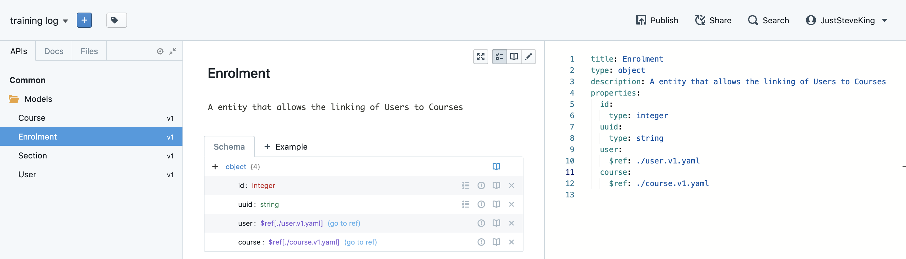

Designing an API _can_ be easy. As long as you approach it in a logical way, and take each part separately, so you do not over complicate the process. For this article I am going to take a theoretical API and walk through how I would design it.


### What we are building?


In this series we will be building a **Training Log API**, what is this? A training log is a simple referencing platform which allows individuals, or organisations, to make a log of what training has been completed as well as marking attendance for training courses.

Possibly one of the first steps for anyone creating an API is figuring out some sort of business logic, what will this system do extactly. These can theen be broken down into user stories/epics/features and go through some level of project management flow to create what will become our sprints.

### Lets figure out what we need

As this is a tutorial, I will not be going completely indepth with what this system will do - it will be a trimmed down API to demonstrate a process. We can break down our requirements in a simple list at this stage. I like to think in a behavioural way at this stage:


- As a user, I must be able to login and register
- As a user, I must be able to see courses available
- As a user, I must be able to enrol on a course
- As a user, I must be able to attend training sessions as part of a course
- As a user, I must be able to see my progress on a course and my completed courses


These are some pretty basic requirements for our training log API. However, even these simple requirements will give us a good insight into how we should approach designing our API.


### Enter Stoplight Studio - API Designer, friend, useful tool

Stoplight is a fantastic tool for designing your API, and the Models within your API. It has a great user interface, and has the benefit of creating openapi spec deocuments for you. For example:

 

Which in turn outputs:

```yaml
title: User
type: object
description: An entity that can log into our system
properties:
  id:
    type: integer
  uuid:
    type: string
```

For this style system a User is always one of the first things that I build, for the purpose of saving reading space I am ommiting none crucial fields from the models.

One we have an entity that is able to access our system we can start to define the connecting models which will in turn define what our API can do.


### Breaking down our requirements

Going through our requirements above, it is easy to see how we could break down our resources and start to map relationships between them. Below I will break down the process:


#### As a user, I must be able to login and register

So a User model will need to be able to access our system - this part is easy enough to understand.


#### As a user, I must be able to see courses available

A User needs to be able to see available courses. So we will need a Course model and one of the requirements is that we need to see only available ones: so this will want a boolean flag to mark availability which we can apply through the API.


#### As a user, I must be able to enrol on a course

So we have a User and we have Courses. Now we need to enrol on them. The easiest option here would be to create a many to many relationship through a pivot table in Laravel it would look like:

```php
<?php

class User extends Model
{
    public function courses()
    {
        return $this->belongsToMany(Course::class);
    }
}

class Course extends Model
{
    public function users()
    {
        return $this->belongsToMany(User::class);
    }
}
```

This, however, is not what I am going to do. For this I will create a new model called Enrolment which will capture both User and Course but will give us more extensibility than a standard pivot relation.


#### As a user, I must be able to attend training sessions as part of a course

So each course will want to be broken into sections, which will have an order to them. From this you can also gather that we will want some meta information to tag onto courses and sections. From working in EdTech previously, I know that a course/section will need to have topics that it covers so that an end user can figure out _what_ they will learn on this course and if they want to do it.

To mark attendance, a simple pivot relation will suffice here for now. I do not think this is the time to think about CQRS and Event Sourcing - while it will give great control and insight into the data, it will be over engineering for what we need.


#### As a user, I must be able to see my progress on a course and my completed courses

So *Users* want to *Enrol* onto a *Course*, which will be tagged with *Topics*, which will allow them to *Attend* the many *Sections* and see progress along the way.

When you look at the feature requirements and the outputted list, there are other areas where improvements could be added - however it is easy to get carried away with yourself and over engineer an API at this point.


#### So, Stoplight Studio - putting the piecse together

Below you will see some examples (screenshots) and markup which you can use in your projects:

### User Model

<div class="flex mb-4">

 

</div>

```yaml
title: User
type: object
description: An entity that can log into our system
properties:
  id:
    type: integer
  uuid:
    type: string
```

### Course Model

<div class="flex mb-4">

 

</div>

```yaml
title: Course
type: object
description: An Entity that Users can Enrol onto
properties:
  id:
    type: integer
  uuid:
    type: string
```


### Enrolment Model

<div class="flex mb-4">

 

</div>

```yaml
title: Enrolment
type: object
description: A entity that allows the linking of Users to Courses
properties:
  id:
    type: integer
  uuid:
    type: string
  user:
    $ref: ./user.v1.yaml
  course:
    $ref: ./course.v1.yaml
```


### Section Model

<div class="flex mb-4">

 

</div>

```yaml
title: Section
type: object
properties:
  id:
    type: integer
  uuid:
    type: string
  course:
    $ref: ./course.v1.yaml
  order:
    type: integer
description: An entity that defines parts of a Course
```


## Conclusion

Breaking down requirements can take a little bit of extra thought, but using a tool like Stoplight to visualise the information is very handy - and actually makes the task a lot nicer! 

In the next part to this series we will be starting some Laravel code going through how we should set up Laravel for an API, and what changes we might want to consider. 
